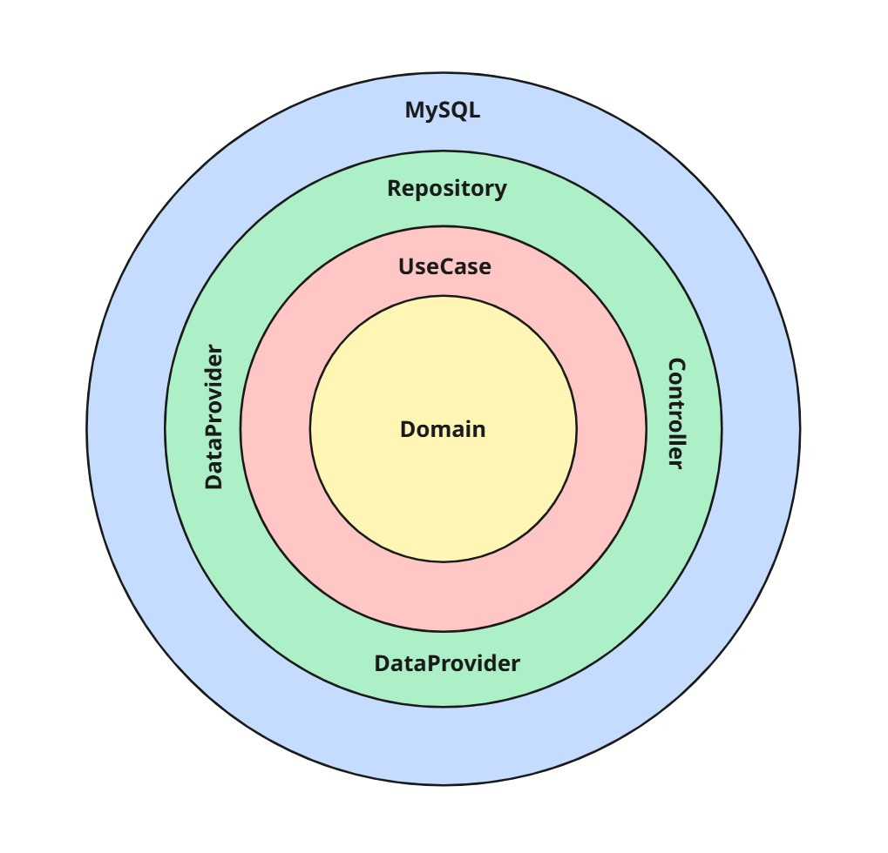

# Cotalizer — API de pagamentos

## Visão Geral

API responsável pela lógica e integração de pagamentos da API principal

---

## Arquitetura & Domínio

### Estilo arquitetural

- **Clean Architecture** (camadas: EntryPoint → Application → Infrastructure → Domain). O diagrama de camadas está no repositório (veja `docs/arquitetura.png`).

**EntryPoint**

- Controllers, DTOs, mappers e middleware de erro.

**Application**

- Use cases, gateways (ports), exceções de aplicação.

**Infrastructure**

- Data providers (integração externa com Stripe), mappers, repositories (MongoDB), security.

**Domain**

- Entidades/domínios puros (sem dependências de frameworks).

### Domínios principais

- **Assinatura**: assinatura do usuário.
- **Usuário**: cadastro, status, quotas mensais

> Dica visual rápida:
> 



---

## Infraestrutura

- **Hospedagem**: Render (SaaS) – disponibilidade diária.
- **Persistência**: MongoDB
- **Autenticação**: API Key

---

## Tecnologias & Dependências

- **Linguagem/Framework**: Java 21, Spring Boot 3.5 (Web, Validation, Security,Data MongoDB)
- **Auth**: Spring Security
- **Testes**: JUnit 5, Mockito, Spring Security Test, JaCoCo
- **Outras**: Lombok

> A lista completa está no pom.xml.
> 

---

## Como Rodar Localmente

**Pré-requisitos**

- Java 21
- Maven 3.9+
- MongoDB em execução (local ou container)

**1) Subir dependências com Docker (exemplo)**

```yaml
# docker-compose.yml (exemplo)
version: "3.8"
services:
  mongo:
    image: mongo:7
    ports: ["27017:27017"]
  minio:
    image: minio/minio:latest
    command: server /data
    environment:
      MINIO_ACCESS_KEY: minio
      MINIO_SECRET_KEY: minio123
    ports: ["9000:9000","9001:9001"]

```

**2) Run**

```bash
mvn clean spring-boot:run

```

**3) Testes & cobertura**

```bash
mvn -q -DskipTests=false test
open target/site/jacoco/index.html

```

---

## Testes, Qualidade & Segurança

- **Testes**: JUnit 5 + Mockito; cobertura com JaCoCo.
- **Números atuais** (exemplo do último relatório):
    - Classes: 75%
    - Métodos: 86%
    - Linhas: 92%
    - **Branch**: 100%

**Autenticação e segurança**

- Apenas via API Key em todos os endpoints

---

## Observabilidade

- **Logs estruturados** (SLF4J):
    - erros em *data providers* para falhas externas (S3, e-mail, etc.)
    - info nos principais *use cases* (Assinatura).

---

## API & Contratos

- Integrações externas:
    - Stripe

**Padrão de resposta (exemplo)**

```json
{
  "dado": { /* payload */ },
  "erro": null
}
```

---

## Licença / Uso

Este repositório é **proprietário** e destinado a uso interno do Cotalizer.

**Não** é liberado para uso, cópia, modificação ou distribuição por terceiros sem autorização expressa.

```
Copyright (c) 2025 Cotalizer.
Todos os direitos reservados.

```
